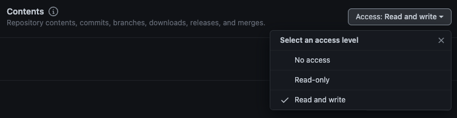

# Google Photos exporter

## What is google-photos-exporter ❓

This is an app that fetches every photo from Google Photos library and uploads it to **Dropbox**, **GitHub** or **Box**.

It is shipped as a GitHub action, but it can be easily built and run by yourself.

## GitHub action 🚀

First of all, it is required to setup Google Photos auth to get a client id, client secret and a non expiring refresh
token. Please follow the steps in [Google Photos OAuth](#google-photos-oauth-).

Then, you need to configure auth for GitHub, Dropbox or Box:

- [**GitHub** token](#github-token-): follow the steps to create a personal token
- [**Dropbox** OAuth](#dropbox-oauth-): follow the steps to get OAuth data
- [**Box** OAuth](#box-oauth-): follow the steps to get OAuth data

### Usage 📕

The mandatory fields are `target` (**github**, **dropbox** or **box**), `googlePhotosClientId`, `googlePhotosClientSecret` and `googlePhotosRefreshToken`.
Additionally there are target dependant mandatory fields.

- For **GitHub** => `githubAccessToken`, `githubRepositoryOwner` and `githubRepositoryName`
- For **Dropbox** => `dropboxAppKey`, `dropboxAppSecret` and `dropboxRefreshToken`
- For **Box** => `boxClientId`, `boxClientSecret` and `boxUserId`

```yaml
- uses: patxibocos/google-photos-exporter@v1.0.0-alpha
  with:
    # Where to upload the photos (must be dropbox, github or box) 
    target:
    # (Optional) Item types to filter (must be photo or video)
    itemType:
    # (Optional) Base path to upload the photos
    prefixPath:
    # (Optional) Max file size (in MB) to upload. In case a file is larger, it will be zipped and splitted
    maxChunkSize:
    # Google Photos client ID
    googlePhotosClientId:
    # Google Photos client secret
    googlePhotosClientSecret:
    # Google Photos refresh token
    googlePhotosRefreshToken:
    # GitHub access token
    githubAccessToken:
    # GitHub repository owner
    githubRepositoryOwner:
    # GitHub repository name
    githubRepositoryName:
    # Dropbox app key
    dropboxAppKey:
    # Dropbox app secret
    dropboxAppSecret:
    # Dropbox refresh token
    dropboxRefreshToken:
    # Box client ID
    boxClientId:
    # Box client secret
    boxClientSecret:
    # Box user ID
    boxUserId:
    # ID of the item to use as offset (not included)
    offsetId:
```

## Auth setup 👮‍♀️

To successfully run this app, a few things need to be setup first.

### Google Photos OAuth 📷

Google Photos API uses OAuth so the user grants access to the given app. For this app to work, it is needed both client
ID and secret for the OAuth app, and also a non-expiring refresh token that will be used to get a new access token every
time the app runs.

In order to get a non-expiring refresh token, please follow the steps described on this StackOverflow
post => https://stackoverflow.com/a/58741728

After completing the steps, you should get the client ID, client secret and refresh token (to be setup later as
environment variables).

### GitHub token 🐈‍⬛

This token will allow this app to push content to the GitHub repository that is configured to be used as storage. To
create one, follow these steps:

1. Head to personal access tokens on GitHub => https://github.com/settings/tokens?type=beta
2. Click on `Generate new token`
3. Under repository access, select `Only select repositories` and choose the one where photos will be exported
4. On `Permissions` section, click on `Repository permissions` and choose `Read and write` access level for `Contents`
   permission:
   
5. Click on `Generate token`

### Dropbox OAuth 💧

1. Go to App Console => https://www.dropbox.com/developers/apps
2. Click on `Create app`
3. For API, choose `Scoped access`
4. On type of access, select `App folder` (unless you want to store the content out of the app folder)
5. Give any desired name to the app
6. Follow the
   steps [here](https://www.codemzy.com/blog/dropbox-long-lived-access-refresh-token#how-can-i-get-a-refresh-token-manually)
   to generate a **long lived refresh token**
7. Get app key and secret from app settings, and refresh token from the previous step

### Box OAuth 📦

1. Create a New App => https://app.box.com/developers/console/newapp
2. Choose `Custom App`
3. Choose `Server Authentication (Client Credentials Grant)`
4. Under Configuration -> Application Scopes -> Check ✔️`Write all files and folders stored in Box`
5. Under Configuration -> Advanced Features -> Check ✔️`Generate user access token`
6. Get client ID and Secret
7. Go to your account (https://app.box.com/account) and grab your Account ID. This is the user ID
8. Under Authorization -> Click on `Review and Submit`
9. Authorize the app

## Build on your own 📙

**Java 8** is the single requirement to build and run. It can be easily installed using [SDKMAN!](https://sdkman.io/)

Once installed, the app must be built using the included Gradle wrapper:

```shell
./gradlew shadowJar
```

This will place a runnable Java jar under **build/libs** directory.

The app can be executed from the command line through a rich CLI:

```shell
java -jar google-photos-exporter.jar -h
```

```shell
Usage: google-photos-exporter options_list
Subcommands: 
    github - GitHub exporter
    dropbox - Dropbox exporter
    box - Box exporter

Options: 
    --itemTypes, -it [PHOTO, VIDEO] -> Item types to include { Value should be one of [photo, video] }
    --maxChunkSize, -mcs -> Max chunk size when uploading to GitHub { Int }
    --prefixPath, -pp [] -> Prefix path to use as parent path for content { String }
    --offsetId, -oi -> ID of the item to use as offset (not included) { String }
    --help, -h -> Usage info 
```

The single argument that needs to be passed is the target to be used, which must be `dropbox` or `github`

The required **environment variables** to be passed are:

- **GOOGLE_PHOTOS_CLIENT_ID**: ID of the OAuth client
- **GOOGLE_PHOTOS_CLIENT_SECRET**: secret of the OAuth client
- **GOOGLE_PHOTOS_REFRESH_TOKEN**: a non expiring refresh token for the OAuth client

Depending on the target more environment variables are needed:

- For **Dropbox**:
    - **DROPBOX_APP_KEY**: app key of the OAuth app
    - **DROPBOX_APP_SECRET**: app secret of the OAuth app
    - **DROPBOX_REFRESH_TOKEN**: refresh token of the OAuth app
- For **GitHub**:
    - **GITHUB_REPOSITORY_OWNER**: owner of the repository where photos will be saved
    - **GITHUB_REPOSITORY_NAME**: name of the repository
    - **GITHUB_ACCESS_TOKEN**: personal access token with write access to the repo where photos will be stored
- For **Box**:
    - **BOX_CLIENT_ID**: client ID of the OAuth app
    - **BOX_CLIENT_SECRET**: client secret of the OAuth app
    - **BOX_USER_ID**: user ID of the user that will be used to upload the content